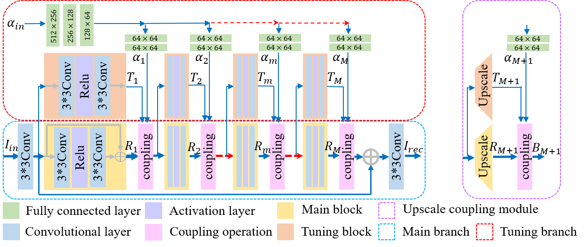
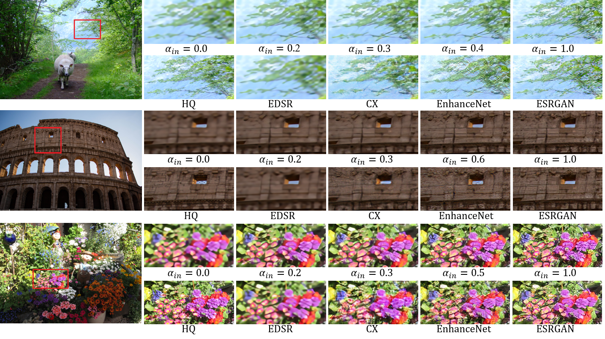
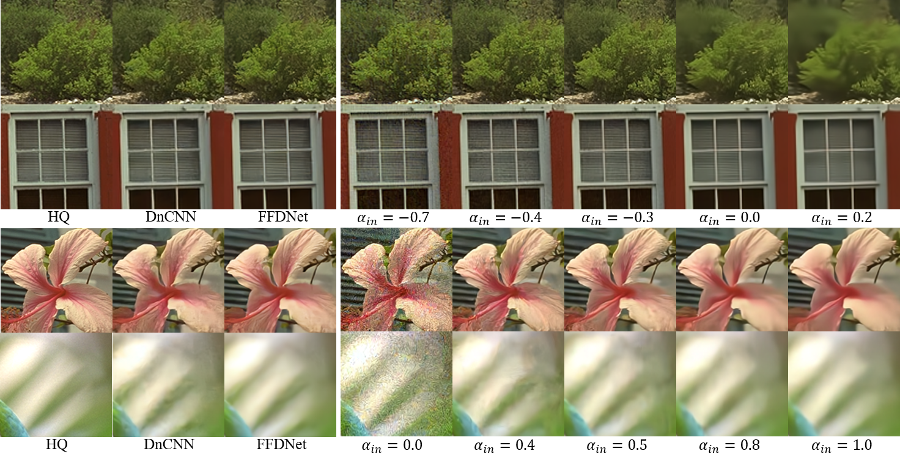
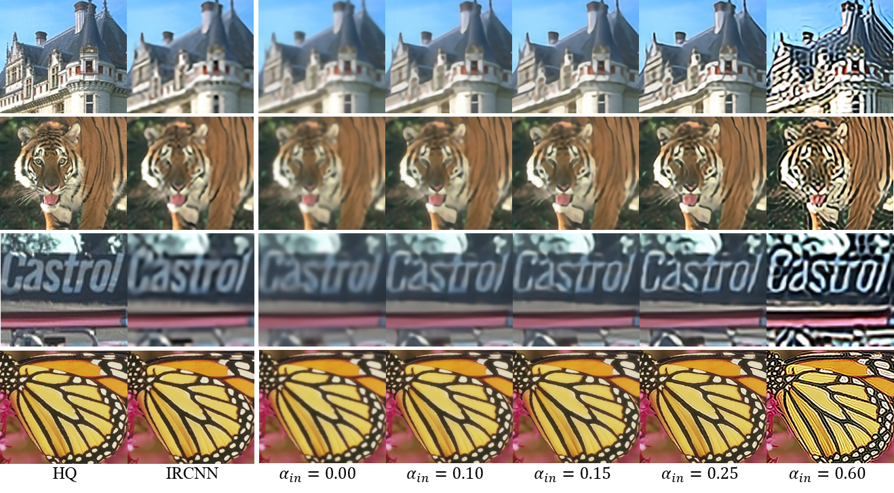

# CFSNet
pytorch code of "CFSNet: Toward a Controllable Feature Space for Image Restoration"（ICCV2019）

#### [arXiv](https://arxiv.org/abs/1904.00634)

<div align=center></div>

Coupling module architecture.



The framework of our proposed controllable feature space network (CFSNet). The details about our proposed CFSNet can be found in [our main paper](https://arxiv.org/abs/1904.00634).

If you find our work useful in your research or publications, please consider citing:

```latex
@article{wang2019cfsnet,
  title={CFSNet: Toward a Controllable Feature Space for Image Restoration},
  author={Wang, Wei and Guo, Ruiming and Tian, Yapeng and Yang, Wenming},
  journal={arXiv preprint arXiv:1904.00634},
  year={2019}
}
```

## Contents
1. [Test](#test)
2. [Results](#results)

## Test

code coming soon...

## Results

#### Visual Results



Perceptual and distortion balance of “215”, “211” and “268” (PIRM test dataset) for 4× image super-resolution.

<div align=center></div>

Smooth control of distortion and perceptual with control scalar α_in from 0 to 1.



Color image denoising results with unknown noise level σ = 15 (first two rows) and σ = 40 (last two rows). α_in = 0.5 and α_in = −0.3 correspond to the highest PSNR results, respectively.

<div align=center></div>

Smooth control of noise reduction and detail preservation with control scalar α_in from 0 to 1.


JPEG image artifacts removal results of “house” and “ocean” (LIVE1) with unknown quality factor 20. α_in = 0.5 corresponds to the highest PSNR results, and the best visual results are marked with red boxes.



Visual results of single image super-resolution with unseen degradation (the blur kernel is 7 × 7 Gaussian kernel with standard deviation 1.6, the scale factor is 3). α_in = 0.15 corresponds to the highest PSNR results.

<div align=center></div>

Smooth control of blur removal and detail sharpening with control scalar α_in from 0 to 1.


